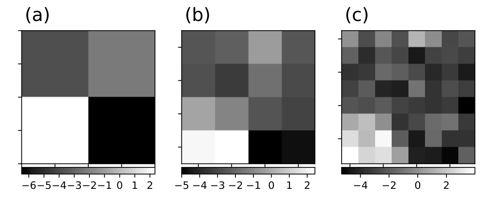
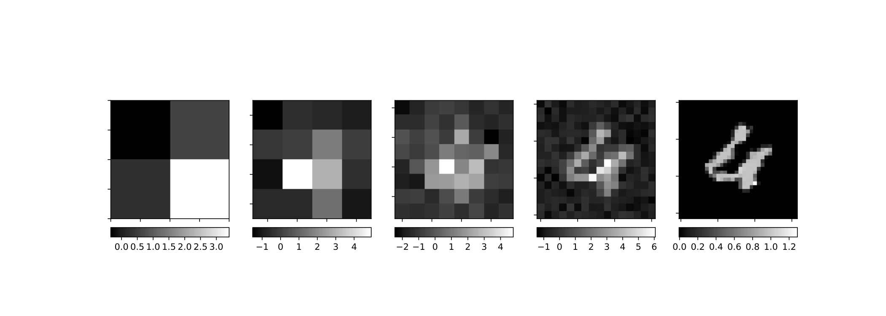

# NerualRG 

Pytorch implement of arXiv paper: [Neural Network Renormalization Group](https://arxiv.org/abs/1802.02840).

**NeuralRG** is a deep generative model using variational renormalization group approach, it is composed by layers of bijectors (In our implementation, we use [RealNVP](https://arxiv.org/abs/1605.08803)). After training, it can generate statistically independent physical configurations with tractable likelihood via directly sampling.

## How do NerualRG work

### Hierarchy Bijectors 

In NerualRG Network(a), we use realNVP (b) networks as building blocks, realNVP is a kind of bijectors, they can transform one distribution into other distribution and revert this process. For multi-in-multi-out blocks, we call they disentanglers(gray blocks in (a)), and for multi-in-single-out blocks, we can they decimators(white blocks in (a)). And stacking  multiply layers of these blocks into a hierarchical structure forms NerualRG network, so NerualRG is also a bijector. In inference process, each layer try to "separate" entangled variables into independent variables, and at layers composed of decimators, we only keep one of these independent variables, this is renormalization group.


The result of renormalization group is that ,in generating process, at shallow layers of NerualRG Network, the configuration formed by output variables is a "blurry" version of deep layers' output. This can be seen from following training results.





### Training

For models with energy function we can derive a lower bound of the loss function using variational approaches. 

We use the Probability Density Distillation loss:
$$
\begin{equation}
\mathcal{L} = \int \mathrm{d}{\boldsymbol{x}}\,  q(\boldsymbol{x}) \left[ \ln{q(\boldsymbol{x})} - \ln{{\pi} (\boldsymbol{x}) } \right]
\end{equation}
$$
Note $ln\pi(\boldsymbol{x})$ is not normalized.
$$
\begin{equation} 
 \mathcal{L} +\ln Z = D_\mathrm{KL}\left(q(\boldsymbol{x})||{\frac{\pi (\boldsymbol{x})}{Z}} \right)\ge 0, 
\end{equation}
$$
So, we can see that loss function has a low bound of $-\ln Z$.

## How to Run 

In this section, We will train a sampler for Ising model to demonstrate NerualRG Network.

### Requirements

* pytorch
* numpy
* matplotlib

### TEBD-like Structure

For TEBD-like structures, we can train using `learn_tebd.py`, some parameters are listed as following:

For specifying Ising model: 

* `-L` specifies size of Ising configuration. e.g. for $4\times4$, using `-L 4`;
* `-T` specifies temperature;
* `-d` specifies the dimension;
* `-exact` gives us a benchmark of how the trained sampler perform.

For specifying training process:

* `-epsilon`, `-beta`, `-delta`, `-omega` specifies how to add regulation term to loss function;
* `-Nepoch` specifies how many epochs we will train;
* `-lr` specifies the learning rate.

For specifying MC process:

* `-Batchsize` specifies how many samples are evaluated at one iteration;
* `-Ntherm` specifies thermalization steps;
* `-Nsteps` specifies measure steps;
* `-Nskips`  specifies skip steps between each measure step.

For specifying NerualRG structure:

* `-Depth` specifies NerualRG layers number;


* `-Nlayers` specifies realNVP blocks' layer number;
* `-Hs` specifies hidden neurones in realNVP blocks' s network;
* `-Ht` specifies hidden neurones in realNVP blocks' t network.


For example, to train a TEBD-like NerualRG of 8 layers of 4-layer realNVP block with 64 hidden neurones in each layer on 2D Ising of $4\times4$ and temperature of 2.269, at each iteration training will use a bath of 64 samples, and samples are gained through a MC process of 0 thermalization steps, 1 measure steps and 0 skip steps. 

```python
python learn_tebd.py -Batchsize 64 -Ntherm 0 -Nsteps 1 -Nskip 0 -Depth 8 -Nlayers 4 -Hs 64 -Ht 64 -target ising -T 2.269 -L 4 -d 2 -Nepoch 500 -lr 0.001 -train_model 
```

### MERA-like Structure

For MERA-like structures, we can train using `learn_mera.py`, some parameters are listed as following:

For specifying Ising model: 

- `-L` specifies size of Ising configuration. e.g. for $4\times4$, using `-L 4`;
- `-T` specifies temperature;
- `-d` specifies the dimension;
- `-exact` gives us a benchmark of how the trained sampler perform.

For specifying training process:

- `-epsilon`, `-beta`, `-delta`, `-omega` specifies how to add regulation term to loss function;
- `-Nepoch` specifies how many epochs we will train;
- `-lr` specifies the learning rate.

For specifying MC process:

- `-Batchsize` specifies how many samples are evaluated at one iteration;
- `-Ntherm` specifies thermalization steps;
- `-Nsteps` specifies measure steps;
- `-Nskips`  specifies skip steps between each measure step.

For specifying NerualRG structure:

- `-Ndisentangler` specifies number of disentangler layers in each NerualRG layer;


- `-Nlayers` specifies realNVP blocks' layer number;
- `-Hs` specifies hidden neurones in realNVP blocks' s network;
- `-Ht` specifies hidden neurones in realNVP blocks' t network.


For example, to train a MERA-like NerualRG of 4 layers(with 2 layers of disentangler blocks and 2 layers of decimator blocks) of 4-layer realNVP block with 64 hidden neurones in each layer on 2D Ising of $4\times4$ and temperature of 2.269, at each iteration training will use a bath of 64 samples, and samples are gained through a MC process of 0 thermalization steps, 1 measure steps and 0 skip steps.

```python
python learn_mera.py -Batch 64 -Ntherm 0 -Nsteps 1 -Nskip 0 -Ndisentangler 1 -Nlayers 4 -Hs 64 -Ht 64 -target ising -T 2.269 -L 4 -d 2 -Nepoch 500 -lr 0.001 -train_model 
```

## Results in the paper

See [notebook](etc/paper.md).

## Citation

If you use this code for your research, please cite our [paper](https://arxiv.org/abs/1802.02840):

```
@article{nerualRG,
  Author = {Shuo-Hui Li and Lei Wang},
  Title = {Neural Network Renormalization Group},
  Year = {2018},
  Eprint = {arXiv:1802.02840},
}
```

## Contact

For questions and suggestions, contact Shuo-Hui Li at [contact_lish@iphy.ac.cn](mailto:contact_lish@iphy.ac.cn).


