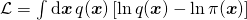
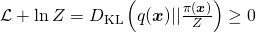

# NerualRG 

Pytorch implement of arXiv paper: Shuo-Hui Li and Lei Wang, *Neural Network Renormalization Group* [arXiv:1802.02840](https://arxiv.org/abs/1802.02840).

**NeuralRG** is a deep generative model using variational renormalization group approach, it is composed by layers of bijectors (In our implementation, we use [RealNVP](https://arxiv.org/abs/1605.08803)). After training, it can generate statistically independent physical configurations with tractable likelihood via directly sampling.

## How does NerualRG work

### Hierarchical Bijectors 

In NerualRG Network(a), we use realNVP (b) networks as building blocks, realNVP is a kind of bijectors, they can transform one distribution into other distribution and revert this process. For multi-in-multi-out blocks, we call they disentanglers(gray blocks in (a)), and for multi-in-single-out blocks, we can they decimators(white blocks in (a)). And stacking  multiply layers of these blocks into a hierarchical structure forms NerualRG network, so NerualRG is also a bijector. In inference process, each layer try to "separate" entangled variables into independent variables, and at layers composed of decimators, we only keep one of these independent variables, this is renormalization group.


The structure we used to construct realNVP networks into NeuralRG network is inspired by multi-scale entanglement renormalization ansatz (MERA), as shown in (a). Also, the process of variable going through our network can be viewed as a renormalization process.

The resulted effect of a trained NeuralRG network can be visualized using gradients plot (a) and MI plot of variables of the same layer (b).

### Training

For models with energy function we can derive a lower bound of the loss function using variational approaches. 

We use the Probability Density Distillation loss:



Note $ln\pi(\boldsymbol{x})$ is not normalized.



So, we can see that loss function has a low bound of $-\ln Z$.

## How to Run 

In this section, We will train a sampler for Ising model to demonstrate NerualRG Network.

## Citation

If you use this code for your research, please cite our [paper](https://arxiv.org/abs/1802.02840):

```
@article{nerualRG,
  Author = {Shuo-Hui Li and Lei Wang},
  Title = {Neural Network Renormalization Group},
  Year = {2018},
  Eprint = {arXiv:1802.02840},
}
```

## Contact

For questions and suggestions, contact Shuo-Hui Li at [contact_lish@iphy.ac.cn](mailto:contact_lish@iphy.ac.cn).


